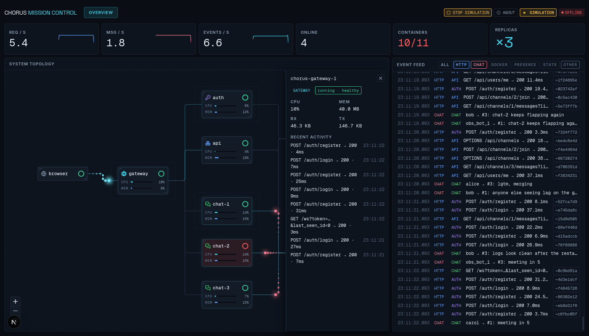
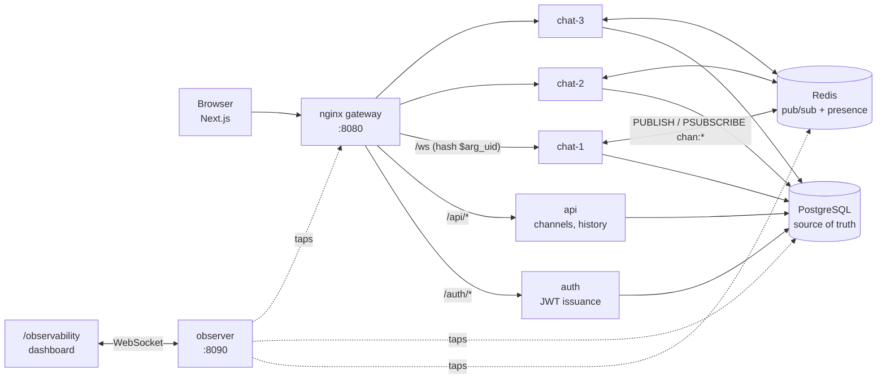
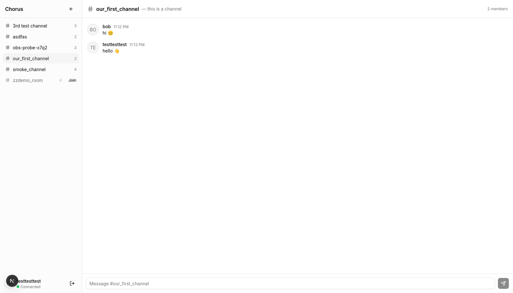
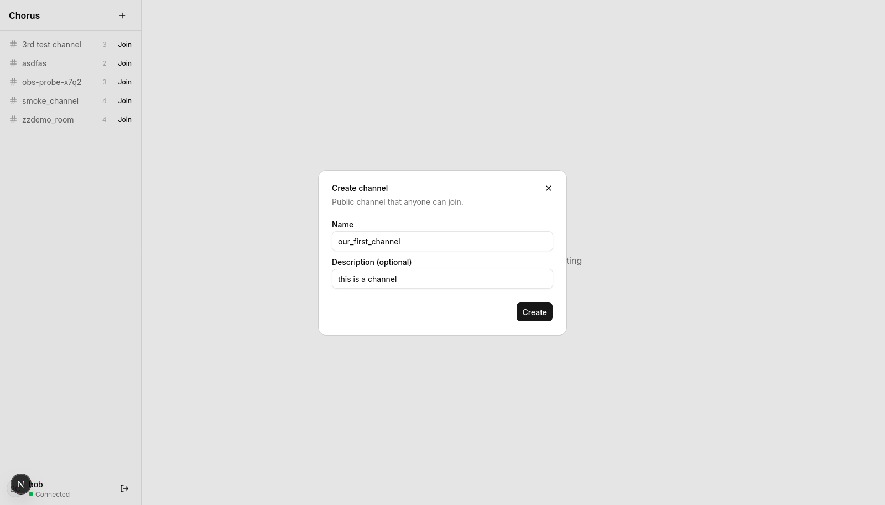

# Chorus

A real-time chat application built as the team project for **Distributed Systems, Summer Semester 2026** (HTW Berlin, Elyess Eleuch).

**Mathieu Wassmuth** (584486) · **Lam Tuan Khanh Nguyen** (0596535)

Chorus is a Discord-style chat app whose point is the architecture behind it: a stateless REST tier and a stateful WebSocket tier behind one gateway, with the chat service running as three replicas that stay in sync through Redis publish/subscribe. It ships with a live observability dashboard that draws that behaviour as it happens.



*The observability dashboard during the fault-tolerance demo: `chat-2` has been killed (red), messages are still fanning out from Redis to the surviving replicas, and every event is listed on the right.*

## Architecture



**Sending a message.** The gateway pins each user to one chat replica with `hash $arg_uid`, so two users in the same channel may be connected to different replicas. The replica that receives a message writes it to Postgres first — which assigns the id, and therefore the ordering — then publishes it to Redis. Every replica subscribes to `chan:*`, so each one delivers the message to its own connected clients. Redis also holds `presence:<uid>` keys with a short TTL, refreshed by heartbeat, which is how the system knows who is online.

**Reconnecting.** Clients track the last message id they saw and send it as `last_seen_id` when they reconnect. The replica replays everything newer from Postgres before resuming the live stream, so a dropped connection loses nothing.

Deeper detail, including the consistency model and per-service boundaries: [`docs/ARCHITECTURE.md`](./docs/ARCHITECTURE.md).

## What we set out to build, and what we shipped

The project was scoped in three tiers ([`docs/PRD.md`](./docs/PRD.md)). **Tier 1 is complete.** Tier 2 planned direct messages, typing indicators, mentions with email notification via RabbitMQ, file uploads and message search; Tier 3 was an optional menu of WebRTC voice and video. We deliberately stopped after Tier 1 rather than start Tier 2 features we could not finish properly, and spent the remaining time on the observability layer instead.

Shipped and working:

| Distributed-systems concept | How it appears in Chorus |
|---|---|
| Horizontal scaling | The chat service runs as three replicas; the gateway addresses them as named peers |
| Load balancing + session affinity | nginx balances `/ws` with `hash $arg_uid`, pinning a user to one replica across reconnects |
| Publish/subscribe messaging | Redis `chan:*` carries every message between replicas, so delivery does not depend on which one you reached |
| Single ordering authority | Postgres assigns message ids; clients order by server id, never by local clock |
| Fault tolerance | Any chat replica can be killed mid-conversation; the survivors keep delivering |
| Reconnect and backfill | `last_seen_id` replay from Postgres closes the gap after a disconnect |
| Presence with TTL | Redis keys expire unless refreshed, trading perfect accuracy for a bounded staleness window |
| Service boundaries | Separate auth, REST and WebSocket services behind one ingress |
| Containerised deployment | Docker Compose runs the whole system, including replica scaling |
| Observability | A dedicated service taps the running system and streams it to a live dashboard |

Not done, and honest about it: **Kubernetes manifests** (`infra/k8s/` holds only a README — the demo runs on Compose), **CI** (a GitHub Actions workflow exists on a separate branch, not merged), and **distributed tracing** (the Jaeger container runs but nothing is instrumented, so it receives no spans).

## Running it

Requires Docker with Compose v2, pnpm 10, and Node — see the note on the version pin below.

```bash
make setup      # creates infra/compose/.env — set JWT_SECRET and POSTGRES_PASSWORD
make install    # frontend dependencies
make demo       # the whole system: backend, 3 chat replicas, observability, frontend
```

Then open:

| | |
|---|---|
| **Chat app** | <http://localhost:3000> |
| **Observability dashboard** | <http://localhost:3000/observability> |

Register two users in two browser windows to see messages cross replicas. `make demo` runs the frontend in the foreground; stop it with Ctrl-C, then `make obs-down` to stop the containers.

<details>
<summary>Other targets, ports, and troubleshooting</summary>

**Node version.** `frontend/package.json` pins `engines: ">=26 <27"` and `frontend/.npmrc` sets `engine-strict=true`, so pnpm refuses to run any script on another version. If `make demo` stops with an engines error, either install Node 26 or relax that pin — the app itself builds and runs on Node 22 and later.

`make` on its own lists everything. The ones worth knowing: `make dev` (same as `demo` but without the observability services), `make health` (curl both gateway health endpoints), `make logs`, `make ps`, `make obs-down` (stop everything), `make clean` (stop **and delete the data volumes**).

Add `ALTPORTS=1` to any target to shift every published host port into a high range (gateway 18080, postgres 15432, redis 16379, observer 18090) if the defaults are taken. `make ports` prints what a given invocation will publish. If you shift the observer port, point the dashboard at it with `NEXT_PUBLIC_OBSERVER_WS_URL` in `frontend/.env.local`.

Ports by default: frontend 3000, gateway 8080, Postgres 5432, Redis 6379, observer 8090 (localhost only), Jaeger UI 16686 (localhost only). `api`, `auth` and `chat` are **not** published — they are reachable only through the gateway.

On startup a one-shot `migrate` service waits for Postgres, runs `alembic upgrade head` and exits; the app services wait for it to complete, so they only ever boot against a known-good schema.

> **If routing breaks after recreating a container:** nginx resolves its upstreams once at startup and caches them, and `nginx.conf` is bind-mounted as a single file, so a restart is not enough. Force a recreate:
> ```bash
> docker compose -f infra/compose/docker-compose.yml --env-file infra/compose/.env \
>   up -d --force-recreate --no-deps gateway
> ```

</details>

## The fault-tolerance demo

```bash
docker kill chorus-chat-2      # SIGKILL — the node stays down
docker start chorus-chat-2     # bring it back
```

Watch it on the dashboard: the node turns red, messages keep fanning out through the surviving replicas, and clients that were pinned to the dead one reconnect and replay what they missed.

`docker kill` counts as a manual stop, so `restart: unless-stopped` deliberately does **not** resurrect the container. It stays dead until you say otherwise, which is what you want while narrating.

Failover is not instantaneous and this file will not pretend otherwise: there is no active health check on the chat upstream, so connections hashed onto the dead peer hang until they time out before nginx marks it down. Measured immediately after a kill, 4 of 9 new connections succeeded; about a minute later, 9 of 9 did. Clients already connected reconnect and backfill.

## Observability

An opt-in, dev-only layer that makes the distributed behaviour visible. `make demo` already starts it; the dashboard is at **<http://localhost:3000/observability>**, and the **ABOUT** button in its header explains everything on screen, including what it cannot show.

Five producers tap signals the system already emits — Docker events and stats through a read-only socket proxy, `PSUBSCRIBE chan:*`, Redis keyspace notifications for presence, `pg_stat_*` pollers, and the gateway's JSON access log — and none of them requires a line of code in `auth`, `api` or `chat`. The one deliberate exception is the WebSocket hop, which nothing outside the chat process can observe: `chat` announces `ws.connect` / `ws.message` / `ws.disconnect` itself, fire-and-forget, so a failure there quiets the dashboard rather than breaking a message.

Everything lands in one Redis stream that serves as bus, ring buffer and replay cursor, and the observer republishes it over a single WebSocket. A dashboard opened mid-demo receives a state snapshot, then recent history, then live events, so it is complete immediately.

Each comet on the topology is one real event, drawn as it happens, with no sampling. Sending a message draws its whole journey: browser to gateway to the replica that accepted it to Redis, then three comets back out to every replica. **If nobody is using the app, press START SIMULATION** to replay a recorded feed, including a scripted node failure — an amber SIMULATION label is shown throughout so recorded data is never mistaken for live.

Protocol, event envelope, security posture and operational traps: [`docs/observability/README.md`](./docs/observability/README.md).

## The app





## Layout

```
├── Makefile              # task runner — `make` lists every target
├── backend/
│   ├── shared/           # SQLAlchemy models, Alembic migrations, settings, JWT helpers
│   ├── auth/             # register, login, token issuance
│   ├── api/              # channels, membership, message history, profile
│   ├── chat/             # WebSocket service, Redis fanout, presence
│   └── observer/         # dev-only: taps the stack, republishes one event stream
├── frontend/             # Next.js app — login, register, chat, /observability
├── infra/
│   ├── compose/          # Docker Compose stack
│   ├── nginx/            # gateway config
│   └── k8s/              # placeholder, see above
├── docs/                 # PRD, architecture, observability runbook
└── screenshots/
```

## Tests

```bash
backend/observer/.venv/bin/python -m pytest backend/observer/tests   # 48 tests
cd frontend && pnpm vitest run                                       # 109 tests
```

Coverage is concentrated on the observability layer (event folding, reconnect and resume, rate derivation, topology routing) and on the chat service's connection handling and message schemas. There is no automated end-to-end test; the cross-replica and failover behaviour described above was verified by hand against the running stack.
