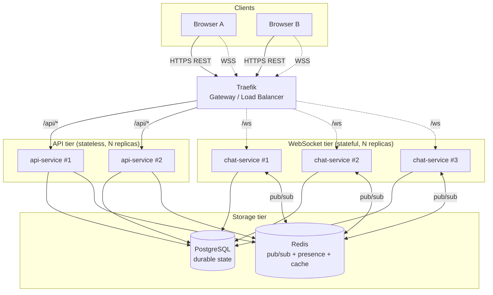
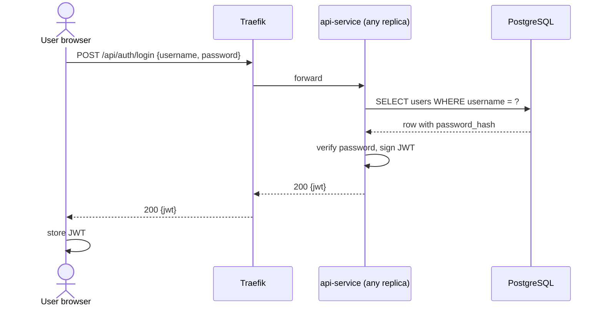
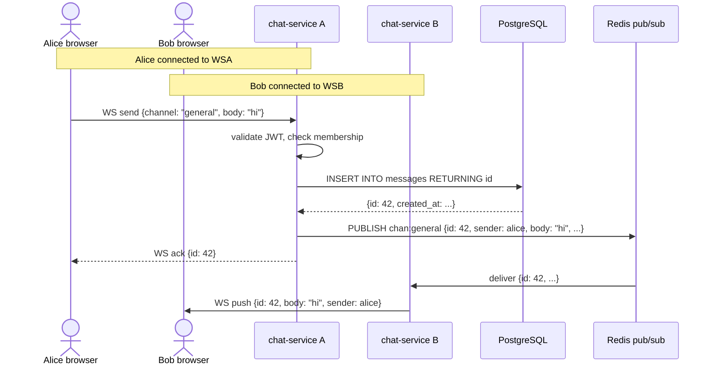
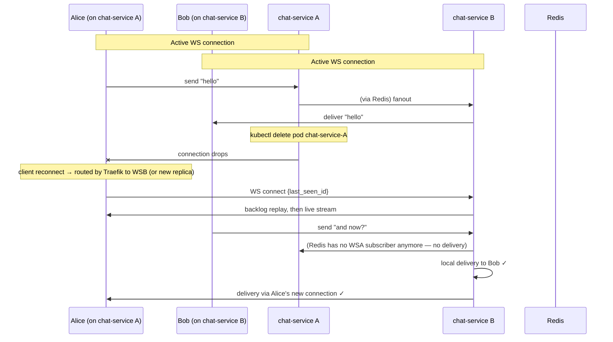
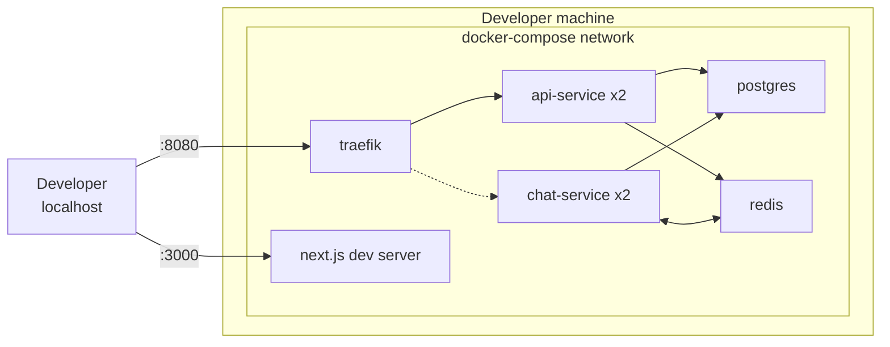
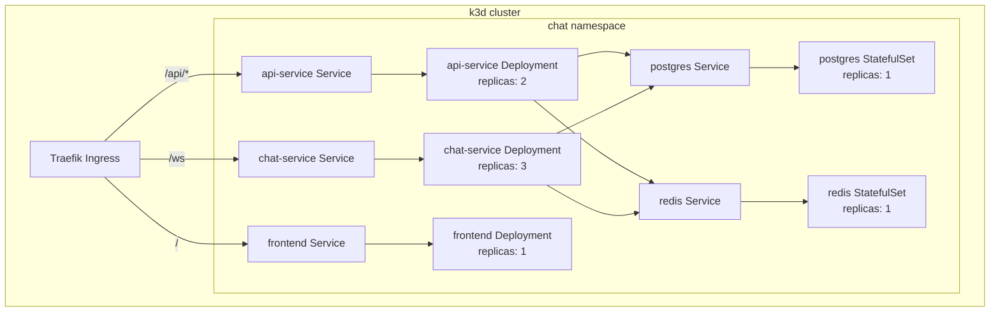

# Architecture — Chorus

**Companion to** [`PRD.md`](./PRD.md). This document describes the system design, service boundaries, data flows, consistency model, deployment topology, and the reasoning behind the stack choices.

---

## 1. Design principles

Five principles drive every design decision in this system. They were agreed at the start of planning and are treated as non-negotiable.

1. **The multi-node story is load-bearing from day one.** A chat app that ticks the feature boxes as a single process would undersell a distributed systems project. Every MVP feature must work correctly across N chat service instances.
2. **The broker narrative drives technology choices.** Redis pub/sub in MVP, RabbitMQ in V2 for durable async work, Kafka only if V3 federation becomes the story. Never pick a broker before the narrative it serves exists.
3. **"Kill a node" is the keystone demo.** Every architectural decision preserves the property that a random chat service instance can be killed mid-conversation and messages continue to flow.
4. **Avoid premature distributed-systems optimization.** No sharding, no consensus protocols, no geo-distribution at MVP scale. Articulate their absence explicitly — that is itself a deliverable.
5. **Eventual consistency is a feature, articulated.** The pub/sub fanout path is eventually consistent; Postgres history is strongly consistent. Each data flow in this document names its consistency model explicitly.

## 2. System overview



Two backend service classes with different scaling characteristics:

- **api-service** handles REST endpoints (auth, channel CRUD, history queries, user profile). Stateless — any instance can serve any request. Scales with HTTP request volume.
- **chat-service** terminates WebSocket connections. Stateful at the connection level (holds a socket per connected client) and subscribed to Redis pub/sub channels for message fanout. Scales with concurrent connections.

This split is deliberate: it gives the project two distinct scaling stories rather than one, and the WebSocket-vs-REST boundary is a natural place to discuss stateful versus stateless service design in the final presentation.

## 3. Services and responsibilities

### 3.1 Traefik (API gateway and load balancer)

- Terminates TLS in the deployment demo.
- Routes `/api/*` requests to `api-service` replicas (round-robin).
- Routes `/ws` WebSocket upgrades to `chat-service` replicas.
- Serves as the single ingress point; frontends never talk to backend services directly.
- In the Kubernetes deployment, doubles as the Ingress controller.
- In V2, enforces rate limits.

### 3.2 api-service (FastAPI)

- REST endpoints:
  - `POST /api/auth/register`, `POST /api/auth/login` — issue JWTs.
  - `GET /api/channels`, `POST /api/channels`, `POST /api/channels/{id}/join` — channel CRUD.
  - `GET /api/channels/{id}/messages?before=<id>&limit=50` — paginated history.
  - `GET /api/users/me` — profile.
- Stateless: no per-process state; every request stands alone with JWT verification.
- Horizontally scalable with zero coordination.

### 3.3 chat-service (FastAPI WebSocket endpoint)

- Endpoint: `/ws` (WebSocket upgrade).
- On connection: verifies JWT, registers the socket in an in-memory map, subscribes the socket's process to the Redis pub/sub channels for the user's joined channels.
- Handles inbound message events: validates, writes to Postgres (which assigns the monotonic ID), publishes to the relevant Redis channel, acks the sender with the canonical message.
- Handles outbound fanout: receives from Redis pub/sub, delivers to all locally-connected sockets subscribed to that channel.
- Handles reconnect with `last_seen_message_id`: replays missed messages from Postgres before resuming live stream.

### 3.4 PostgreSQL (durable storage)

The source of truth for all persistent state.

**Schema (MVP draft):**

```sql
users (
  id            bigserial primary key,
  username      text unique not null,
  email         text unique not null,
  password_hash text not null,
  created_at    timestamptz default now()
);

channels (
  id          bigserial primary key,
  name        text unique not null,
  description text,
  created_by  bigint references users(id),
  created_at  timestamptz default now()
);

channel_members (
  channel_id bigint references channels(id),
  user_id    bigint references users(id),
  joined_at  timestamptz default now(),
  primary key (channel_id, user_id)
);

messages (
  id         bigserial primary key,   -- monotonic ID: THE ordering authority
  channel_id bigint references channels(id),
  sender_id  bigint references users(id),
  body       text not null,
  created_at timestamptz default now()
);

-- Key indexes
create index on messages (channel_id, id desc);   -- history queries
create index on channel_members (user_id);        -- "which channels does user X belong to?"
```

**Why the `messages.id` monotonic `bigserial` matters:** Postgres assigns IDs strictly increasing inside a single database process. This is the system's ordering authority. Clients sort by this ID, never by wall-clock timestamps, which avoids clock-skew and concurrency ordering issues.

### 3.5 Redis (cache, pub/sub, presence)

Redis wears three hats at MVP scale.

**Pub/sub — cross-node message fanout.** One Redis channel per chat channel, keyed `chan:<channel_id>`. When chat-service-A writes a message to Postgres, it publishes the canonical message onto `chan:<channel_id>`. All chat-service instances subscribed to that key receive the payload and push it to their locally-connected clients. Fire-and-forget semantics — durability is already provided by Postgres.

**Presence.** Key per online user, `presence:<user_id>`, with a short TTL (default 30 s) refreshed by a WebSocket heartbeat. Expiry handles disconnects automatically — no explicit "go offline" call needed.

**Cache.** User profile lookups, channel metadata, JWT blacklist (if logout is implemented).

### 3.6 Next.js frontend

- Server-rendered for the marketing/login pages (if any); client-side for the chat view.
- Uses `react-query` (or similar) for REST data.
- Thin WebSocket client wrapper that handles: connect, auth handshake, reconnect with backoff, `last_seen_message_id` bookkeeping, event dispatch.
- Renders messages sorted by server-assigned ID, never by local timestamp.

## 4. Data flow walkthroughs

### 4.1 Login



**Consistency:** strongly consistent (Postgres read). Stateless: any api-service replica can serve this.

### 4.2 Sending a message (multi-node fanout)



**Key observation:** Alice and Bob are on *different* chat-service instances, yet message delivery works. The coupling between instances is Redis pub/sub — neither instance needs to know the other exists.

**Consistency:**
- Postgres write: strongly consistent; the message and its ID are durable and ordered before fanout begins.
- Redis pub/sub fanout: eventually consistent, fire-and-forget. If a subscriber briefly misses a publish, the next history fetch or reconnect replay from Postgres will surface it. The combination gives us real-time delivery *plus* durability — neither property alone is sufficient.

### 4.3 Reconnect with backlog replay

```mermaid
sequenceDiagram
    actor U as User browser
    participant WS as chat-service
    participant PG as PostgreSQL
    participant RD as Redis pub/sub

    Note over U,WS: Active session; last_seen = 100
    Note over U: Network disconnects
    Note over U: Backoff reconnect

    U->>WS: WS connect {jwt, last_seen_id: 100}
    WS->>WS: verify JWT
    WS->>PG: SELECT * FROM messages WHERE channel_id IN (...) AND id > 100 ORDER BY id ASC
    PG-->>WS: rows [101, 102, 103, 104, 105]
    WS->>U: WS push backlog [101..105]
    WS->>RD: SUBSCRIBE chan:<each user channel>
    Note over U,WS: Live stream resumed
```

**Why this is the architecture, not an afterthought:** Without `last_seen_id` bookkeeping and Postgres replay, a user who disconnects for five seconds would silently lose any messages that were only published via Redis pub/sub during that window. Redis pub/sub does not retain messages. Postgres is the durability anchor that makes real-time delivery correct.

### 4.4 Kill a chat-service instance



No messages lost, no users stuck. This is the "kill-a-node" moment of the final demo.

## 5. Consistency model — summary table

| Data path | Store | Consistency | Rationale |
|---|---|---|---|
| User credentials | Postgres | Strongly consistent | Auth must be correct; writes are rare |
| Channel metadata and membership | Postgres | Strongly consistent | Source of truth for access control |
| Message history and ordering | Postgres, monotonic `id` | Strongly consistent | Single authority for order; avoids clock skew |
| Live message delivery across nodes | Redis pub/sub | Eventually consistent | Fire-and-forget, complemented by Postgres replay on reconnect |
| Presence (online status) | Redis with TTL | Eventually consistent | Small staleness window acceptable (30 s) |
| Authentication tokens | JWT (stateless) | N/A | No server-side session state |

## 6. Deployment topology

### 6.1 Local development — Docker Compose



- Brought up with a single `docker compose up --build`.
- Frontend hot-reloads from the host's file system.
- Two replicas each of api-service and chat-service, already sufficient to exercise the multi-node fanout path during development.
- Data volumes persist Postgres and Redis across restarts.

### 6.2 Deployment demo — Kubernetes (k3d)



- Manifests live in `infra/k8s/`.
- Postgres and Redis as StatefulSets with persistent volume claims.
- api-service and chat-service as Deployments — `kubectl scale` demonstrably increases replicas.
- Liveness and readiness probes on every backend Deployment.
- A `NOTES.md` in the manifests directory documents the demo commands (`kubectl get pods`, `kubectl delete pod`, etc.).

## 7. Tech stack rationale

### Backend — Python + FastAPI

Both team members have prior experience with FastAPI from previous coursework. FastAPI's native async and WebSocket support are sufficient at the demo scale targeted by the NFRs. The alternative of splitting out a Go WebSocket gateway would add deployment and integration complexity that is not justified until we know where the bottlenecks actually are. All-Python for MVP is the pragmatic default.

### Database — PostgreSQL, shared across services

A single shared Postgres instance rather than a database-per-service is a deliberate departure from strict microservices orthodoxy. The per-service-DB pattern creates migration complexity and cross-service consistency problems that a two-person team cannot address well in one semester. Sharing Postgres is simpler, correct, and the right call at this scale. If a specific service genuinely needs isolation later, it can be split.

### Cache and pub/sub — Redis

Redis fills three roles cleanly at MVP scale: cache, ephemeral state with TTL (presence), and publish/subscribe for cross-node fanout. Using one tool for three roles simplifies operations. Redis pub/sub is the right fanout primitive here specifically because durability is not a requirement for this path — Postgres already owns durability. Fire-and-forget semantics are a feature, not a limitation.

### Message broker — staged introduction

- **MVP uses Redis only.** No RabbitMQ, no Kafka. The one broker need in MVP (cross-node chat fanout) is solved by Redis pub/sub.
- **V2 introduces RabbitMQ** once there is genuine async durable work (emailing on @mention, processing file uploads). RabbitMQ adds durable queues, acks, and retries — a distinctly different distributed pattern from Redis pub/sub, which is what makes it worth introducing as a teaching moment rather than just an operational addition.
- **Kafka is a V3-only consideration** in the context of federation or event sourcing, which are not in the deliverable scope.

### Gateway — Traefik

Traefik is declarative, reads Docker labels directly, doubles as a Kubernetes Ingress controller without reconfiguration, and handles TLS termination. Kong is heavier for no benefit at this scale; a custom FastAPI gateway would require implementing routing, auth-forwarding, and rate-limiting from scratch, none of which teaches anything specific to distributed systems.

### Service discovery — platform-native

Docker Compose's internal DNS resolves service names in development; Kubernetes Services handle it in the deployment demo. A dedicated service registry like Consul is unnecessary at this scale and is explicitly rejected as over-engineering.

### Frontend — Next.js + Tailwind + shadcn/ui

Reuses the stack both team members know from prior coursework. Next.js's SSR capabilities are mostly unused for a client-heavy chat SPA, but the component and tooling familiarity outweighs theoretical elegance. Shipping velocity is the primary consideration.

### Orchestration — Docker Compose → Kubernetes (k3d)

Docker Compose is the daily-driver development environment. Kubernetes is the deployment-demo target because the course syllabus covers orchestration and scaling concepts that Compose cannot demonstrate. k3d is chosen over minikube for a smaller footprint and faster iteration. This Compose-to-Kubernetes transition is itself a distributed systems lesson worth narrating in the final presentation.

### CI/CD — GitHub Actions

Free for public repos of this size, well-integrated with GitHub Issues and PRs, and sufficient for build-plus-test on every push.

## 8. Things this design intentionally does not do

It is as important to articulate what the system does *not* do, and why:

- **No consensus protocol (Raft / Paxos).** There is no replicated state requiring leader election. Postgres is a single writer; Redis is a single writer. When those become bottlenecks (they will not at demo scale), the answer is primary-replica replication, not consensus.
- **No database sharding.** A single Postgres instance trivially handles the NFR-1 through NFR-5 targets.
- **No geo-distribution.** Single-region deployment only.
- **No message queue durability in MVP.** Chat messages are durable via Postgres; live delivery is best-effort via Redis pub/sub; the combination is sufficient because reconnect-with-backfill closes the gap.
- **No custom protocol.** JSON over WebSocket for realtime, plain REST for everything else. Binary protocols, protobuf, and similar optimizations are irrelevant at this scale.

Each of these absences is justifiable in the final presentation with a concrete reason tied to the NFR targets, rather than hand-waving.
